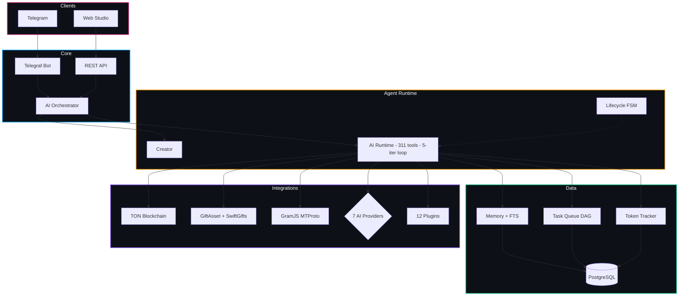

<div align="center">

<br>

<h1>🤖 TON Agent Platform</h1>

<p><b>Создавай автономных AI-агентов для блокчейна TON — голосом или текстом, без кода</b></p>
<p><i>Create autonomous AI agents for the TON blockchain — by voice or text, no code required</i></p>

<br>

[](https://identityhub.app/contests/ai-hackathon?submission=cmmnwv6sg001b01oboxo8f57r)
[](https://identityhub.app/contests/agent-tooling-fast-grants?submission=cmlz5smqj000101p7wao32nfd)

<br>

[](https://www.typescriptlang.org)
[](https://nodejs.org)
[](https://www.postgresql.org)
[](LICENSE)
[](https://tonagentplatform.com)
[](https://t.me/TonAgentPlatformBot)

<br>

[**🤖 Запустить бота**](https://t.me/TonAgentPlatformBot) &nbsp;·&nbsp; [**🎨 Открыть Studio**](https://tonagentplatform.com/studio.html) &nbsp;·&nbsp; [**🌐 Сайт**](https://tonagentplatform.com) &nbsp;·&nbsp; [**📢 Канал**](https://t.me/TONAgentPlatform)

<br>

</div>

---

## 🇷🇺 О проекте &nbsp;|&nbsp; 🇬🇧 About

<table>
<tr>
<td width="50%" valign="top">

### 🇷🇺 Русский

**TON Agent Platform** — инфраструктура для создания автономных AI-агентов, работающих в блокчейне TON через Telegram.

Просто опиши задачу текстом или голосом — AI сгенерирует промпт, подберёт инструменты и задеплоит агента за секунды. Никакого кода, никаких серверов.

Каждый агент получает собственный TON-кошелёк, умеет торговать подарками, взаимодействовать с DeFi, работать как настоящий Telegram-пользователь через MTProto и выполнять задачи 24/7.

> Построено двумя молодыми разработчиками. Победители TON Grant.

</td>
<td width="50%" valign="top">

### 🇬🇧 English

**TON Agent Platform** is infrastructure for building autonomous AI agents operating on the TON blockchain through Telegram.

Just describe your task in text or voice — AI generates a system prompt, picks the right tools, and deploys the agent in seconds. No code. No servers.

Each agent gets its own TON wallet, can trade gifts, interact with DeFi, operate as a real Telegram user via MTProto, and work 24/7 autonomously.

> Built by two young developers from Russia. Previous TON Grant winners.

</td>
</tr>
</table>

---

## ✨ Ключевые возможности &nbsp;|&nbsp; Key Features

<table>
<tr>
<td width="50%">

### 🇷🇺

| | Возможность | Описание |
|:-|:------------|:---------|
| 🎙️ | **Голосовое создание** | Надиктуй задачу — агент готов за 10 сек |
| 🤖 | **7 AI-провайдеров** | Gemini, GPT-4o, Claude, Groq, DeepSeek... |
| 🛠️ | **311 инструментов** | TON, подарки, NFT, DeFi, веб, Telegram |
| 🎁 | **Маркетплейс подарков** | Реальные цены, арбитраж, авто-торговля |
| 📱 | **MTProto Userbot** | Агент = настоящий Telegram-пользователь |
| 🧠 | **Память агента** | Персистентная + FTS-поиск + дневные логи |
| 📊 | **Studio Dashboard** | 29 вкладок: настройки, графики, задачи |
| 🔬 | **Agent Evals** | Авто-оценка качества, алерты деградации |
| 📚 | **База знаний** | Загрузка документов, индексация, FTS-поиск |
| 🔐 | **Безопасность** | Sandbox, SSRF, anti-loop, op-lock |

</td>
<td width="50%">

### 🇬🇧

| | Feature | Description |
|:-|:--------|:------------|
| 🎙️ | **Voice Creation** | Speak your task — agent ready in 10 sec |
| 🤖 | **7 AI Providers** | Gemini, GPT-4o, Claude, Groq, DeepSeek... |
| 🛠️ | **311 Tools** | TON, gifts, NFTs, DeFi, web, Telegram |
| 🎁 | **Gift Marketplace** | Real-time pricing, arbitrage, auto-trading |
| 📱 | **MTProto Userbot** | Agent operates as a real Telegram user |
| 🧠 | **Agent Memory** | Persistent + FTS search + daily logs |
| 📊 | **Studio Dashboard** | 29 settings tabs: charts, tokens, tasks |
| 🔬 | **Agent Evals** | Auto quality scoring, degradation alerts |
| 📚 | **Knowledge Base** | Upload docs, chunk & index, FTS search |
| 🔐 | **Security** | Sandbox, SSRF, anti-loop, op-lock |

</td>
</tr>
</table>

---

## 🏗️ Архитектура &nbsp;|&nbsp; Architecture



---

## 🛠️ Инструменты агента &nbsp;|&nbsp; Agent Tools (311)

| Категория | Примеры | # |
|:----------|:--------|:-:|
| 💎 **TON Blockchain** | `get_ton_balance` `send_ton` `get_nft_floor` `get_agent_wallet` | 4 |
| 🎁 **Gift Marketplace** | `get_gift_floor_real` `scan_real_arbitrage` `buy_catalog_gift` `buy_resale_gift` `get_price_list` `get_user_portfolio` | 15 |
| 💱 **DeFi** | `dex_get_prices` `dex_swap_simulate` `dex_get_pool_info` `dex_get_routes` | 4 |
| 📡 **Telegram Userbot** | `tg_send_message` `tg_get_messages` `tg_join_channel` `tg_search_messages` `tg_react` `tg_create_poll` | 20 |
| 🌐 **Web & Search** | `web_search` `fetch_url` `http_fetch` | 3 |
| 🔔 **Notifications** | `notify` `notify_rich` `get_state` `set_state` | 4 |
| 🤝 **Multi-Agent** | `ask_agent` `list_my_agents` `run_plugin` `list_plugins` | 4 |
| 🖼️ **NFT Analytics** | `get_nft_collection` `get_nft_items` `get_nft_history` | 3 |
| ⏰ **Scheduling** | `set_timer` `cancel_timer` `sleep` `get_time` | 4 |
| 🔌 **Plugins** | 12 плагинов / 12 plugins | ~23 |

---

## 🔌 Плагины &nbsp;|&nbsp; Plugins

| Плагин | Категория | Описание |
|:-------|:---------|:---------|
| **DeDust DEX** | DeFi | Свапы, пулы / Swaps, liquidity pools |
| **STON.fi DEX** | DeFi | AMM свапы / AMM swaps, analytics |
| **EVAA Lending** | DeFi | Кредитование / Lending on EVAA Protocol |
| **TonAPI Pro** | Data | Кошельки, NFT / Wallets, NFTs, txs |
| **CoinGecko** | Data | Крипто-цены / Crypto prices real-time |
| **Whale Tracker** | Analytics | Мониторинг китов / Whale monitoring |
| **TON Stat** | Analytics | Статистика сети / Network & DEX stats |
| **Discord** | Alerts | Discord уведомления / Notifications |
| **Email** | Alerts | SMTP алерты / SMTP email alerts |
| **Slack** | Alerts | Slack уведомления / Slack notifications |
| **Drain Detector** | Security | AI-защита / AI wallet drain defense |
| **Contract Auditor** | Security | Аудит контрактов / Contract risk analysis |

---

## 🎨 Studio Dashboard

<table>
<tr>
<td width="50%" valign="top">

### 🇷🇺 Вкладки Studio

- 🌟 **Soul** — промпт и личность агента
- 🛡️ **Security** — правила безопасности
- 📈 **Strategy** — бизнес-цели и стратегия
- 💓 **Heartbeat** — задачи в режиме ожидания
- 🤖 **AI Settings** — провайдер, модель, ключ
- ♻️ **Lifecycle** — статус, аптайм, старт/стоп
- 📊 **Token Usage** — расход, бюджет, графики
- 🧠 **Memory** — редактор + FTS-поиск
- 📋 **Tasks** — задачи с зависимостями (DAG)
- 👥 **Contacts** — история и права юзеров
- 📡 **Telegram** — авторизация MTProto (QR)
- 💎 **Wallet** — TON-кошелёк агента
- 💬 **Chat** — история и тест-диалог

</td>
<td width="50%" valign="top">

### 🇬🇧 Studio Tabs

- 🌟 **Soul** — agent prompt and personality
- 🛡️ **Security** — immutable safety rules
- 📈 **Strategy** — business goals and strategy
- 💓 **Heartbeat** — proactive idle tasks
- 🤖 **AI Settings** — provider, model, API key
- ♻️ **Lifecycle** — status, uptime, start/stop
- 📊 **Token Usage** — consumption, budget, charts
- 🧠 **Memory** — persistent editor + FTS search
- 📋 **Tasks** — task queue with DAG dependencies
- 👥 **Contacts** — user history and permissions
- 📡 **Telegram** — MTProto auth (QR login)
- 💎 **Wallet** — agent's TON wallet
- 💬 **Chat** — conversation history + test dialog

</td>
</tr>
</table>

---

## 🚀 Быстрый старт &nbsp;|&nbsp; Quick Start

```bash
# 1. Клонируй / Clone
git clone https://github.com/uheartattack/TonAgentPlatform
cd TonAgentPlatform && pnpm install

# 2. Настрой / Configure
cp apps/builder-bot/.env.example apps/builder-bot/.env
# Заполни: BOT_TOKEN, DATABASE_URL, AI API ключи (опционально)
# Fill in: BOT_TOKEN, DATABASE_URL, AI API keys (optional)

# 3. База данных / Database
docker compose -f infrastructure/docker-compose.prod.yml up -d

# 4. Старт / Start
pnpm --filter builder-bot dev
```

Telegram → [@TonAgentPlatformBot](https://t.me/TonAgentPlatformBot) → `/start`

---

## ⚙️ Технологии &nbsp;|&nbsp; Tech Stack

| Слой / Layer | Технология |
|:-------------|:-----------|
| **Bot Framework** | Telegraf v4 |
| **Language** | TypeScript 5.x (strict) |
| **AI Providers** | Gemini 2.5, Claude, GPT-4o, Groq, DeepSeek, OpenRouter, Together |
| **Database** | PostgreSQL 15 + Drizzle ORM |
| **Sandbox** | Node.js VM (isolated, SSRF-protected) |
| **TON** | @ton/core · @ton/ton · @ton/crypto · TonAPI v2 |
| **Telegram** | GramJS MTProto + Telegraf |
| **Gift APIs** | GiftAsset + SwiftGifts (rate-limited, cached) |
| **Infra** | Docker Compose + nginx + PM2 + Let's Encrypt |

---

## 🔐 Безопасность &nbsp;|&nbsp; Security

| Защита / Protection | Описание / Description |
|:--------------------|:-----------------------|
| **Sandbox VM** | Нет доступа к `fs`, `child_process`, `net` |
| **SSRF Protection** | Блокировка localhost + private IPs |
| **Anti-Loop Guard** | A-B-A-B детектор, stall detection |
| **Flood Gate** | Адаптивный flood gate с jitter |
| **Op Lock** | Атомарный лок финансовых операций |
| **Memory Guard** | Защита памяти от poisoning в группах |
| **IDOR Check** | Проверка владельца на каждом endpoint |
| **Input Sanitize** | Prompt injection defense |

---

## 📈 Дорожная карта &nbsp;|&nbsp; Roadmap

- [x] AI-first создание агентов (текст + голос)
- [x] 7 AI-провайдеров с fallback-цепочкой
- [x] 311 инструментов агента
- [x] Telegram Userbot (MTProto)
- [x] GiftAsset + SwiftGifts реальные цены
- [x] Studio Dashboard (29 вкладок)
- [x] Память, задачи, трекинг токенов
- [x] 12 плагинов + 22 шаблона + маркетплейс
- [x] Голосовые команды
- [x] TON Connect v2
- [ ] Telegram Mini App
- [ ] On-chain реестр агентов
- [ ] DAO + платформенный токен

---

## 📁 Структура &nbsp;|&nbsp; Project Structure

```
ton-agent-platform/
├── apps/
│   ├── builder-bot/            # Основное приложение / Main app
│   │   ├── src/
│   │   │   ├── agents/         # AI runtime, orchestrator, runner, tools
│   │   │   ├── services/       # Lifecycle, memory, tasks, tokens, hooks
│   │   │   ├── api-server.ts   # REST API (80+ endpoints)
│   │   │   ├── bot.ts          # Telegram bot handlers
│   │   │   └── db/             # PostgreSQL schema + Drizzle ORM
│   │   └── plugins/            # 12 installable plugins
│   └── landing/                # Web Studio
│       ├── studio.html
│       ├── studio.js           # ~11K lines of Studio logic
│       └── studio.css
├── infrastructure/             # Docker Compose, nginx
└── packages/                   # Shared packages
```

---

<div align="center">

<br>

**💎 Построено для экосистемы TON &nbsp;|&nbsp; Built for the TON ecosystem 💎**

<br>

[tonagentplatform.com](https://tonagentplatform.com) &nbsp;·&nbsp; [@TonAgentPlatformBot](https://t.me/TonAgentPlatformBot) &nbsp;·&nbsp; [Telegram Channel](https://t.me/TONAgentPlatform)

<br>

<sub>Made with ❤️ by two young developers from Russia &nbsp;|&nbsp; Сделано двумя молодыми разработчиками из России</sub>

<br>

[](https://github.com/uheartattack/TonAgentPlatform)

</div>
