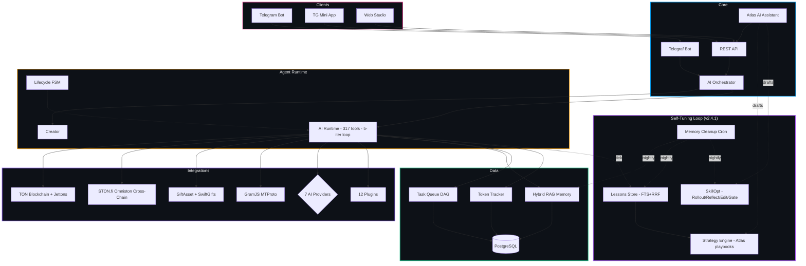

<div align="center">

<br>

<h1>🤖 TON Agent Platform</h1>

<p><b>Создавай автономных AI-агентов для блокчейна TON — голосом или текстом, без кода</b></p>
<p><i>Create autonomous AI agents for the TON blockchain — by voice or text, no code required</i></p>

<br>

[](https://identityhub.app/contests/ai-hackathon?submission=cmmnwv6sg001b01oboxo8f57r)
[](https://identityhub.app/contests/agent-tooling-fast-grants?submission=cmlz5smqj000101p7wao32nfd)

<br>

[](https://github.com/uheartattack/TonAgentPlatform/releases/tag/v2.4.2)
[](https://omniston.ston.fi)
[](https://www.typescriptlang.org)
[](https://nodejs.org)
[](https://www.postgresql.org)
[](LICENSE)
[](https://tonagentplatform.com)
[](https://t.me/TonAgentPlatformBot)
[](https://t.me/TonAgentPlatformBot/studio)

<br>

[**🤖 Запустить бота**](https://t.me/TonAgentPlatformBot) &nbsp;·&nbsp; [**📱 Open Mini App**](https://t.me/TonAgentPlatformBot/studio) &nbsp;·&nbsp; [**🎨 Web Studio**](https://tonagentplatform.com/studio.html) &nbsp;·&nbsp; [**👑 Founders Wall**](https://tonagentplatform.com/founders.html) &nbsp;·&nbsp; [**📢 Канал**](https://t.me/TONAgentPlatform)

<br>

</div>

---

## 🇷🇺 О проекте &nbsp;|&nbsp; 🇬🇧 About

<table>
<tr>
<td width="50%" valign="top">

### 🇷🇺 Русский

**TON Agent Platform** — инфраструктура для создания автономных AI-агентов, работающих в блокчейне TON через Telegram.

Просто опиши задачу текстом или голосом — AI сгенерирует промпт, подберёт инструменты и задеплоит агента за секунды. Никакого кода, никаких серверов.

Каждый агент получает собственный TON-кошелёк, умеет торговать подарками, взаимодействовать с DeFi, работать как настоящий Telegram-пользователь через MTProto и выполнять задачи 24/7.

> Построено двумя молодыми разработчиками. Победители TON Grant.

</td>
<td width="50%" valign="top">

### 🇬🇧 English

**TON Agent Platform** is infrastructure for building autonomous AI agents operating on the TON blockchain through Telegram.

Just describe your task in text or voice — AI generates a system prompt, picks the right tools, and deploys the agent in seconds. No code. No servers.

Each agent gets its own TON wallet, can trade gifts, interact with DeFi, operate as a real Telegram user via MTProto, and work 24/7 autonomously.

> Built by two young developers from Russia. Previous TON Grant winners.

</td>
</tr>
</table>

---

## ✨ Ключевые возможности &nbsp;|&nbsp; Key Features

<table>
<tr>
<td width="50%">

### 🇷🇺

| | Возможность | Описание |
|:-|:------------|:---------|
| 🌉 | **Omniston Cross-Chain (v2.4.2)** | Кросс-чейн бридж стейблов TON ↔ Base / Polygon / Ethereum / BNB через STON.fi Omniston (SDK v1beta8). Агент котирует и готовит payload — юзер подписывает в своём кошельке |
| 🎓 | **Self-Tuning Agents (v2.4.1)** | Агенты учатся на каждом запуске: lessons + Atlas-стратегии + SkillOpt автотюнинг промптов |
| 📱 | **Telegram Mini App (v2.4)** | Studio открывается прямо в TG: initData auto-login, BackButton/MainButton/Haptic, frosted-glass drawer |
| 🪙 | **Jetton Launchpad (v2.4)** | `jetton_deploy` + `jetton_mint` + `jetton_freeze` — TEP-74 минтабельные жетоны в один тул-кол |
| 🧠 | **Agent Skills (v2.2)** | Стандарт agentskills.io от Anthropic — прогрессивная подгрузка инструкций |
| 💎 | **Agentic Wallets (v2.2)** | Официальный TON Foundation стандарт agents.ton.org: on-chain freeze/revoke, лимиты в контракте |
| 🎙️ | **Голосовое создание** | Надиктуй задачу — агент готов за 10 сек |
| 🤖 | **7 AI-провайдеров** | Gemini, GPT-4o, Claude, Groq, DeepSeek, OpenRouter, Together |
| 🛠️ | **317 инструментов** | TON, жетоны, подарки, NFT, DeFi, веб, Telegram |
| 🎁 | **Маркетплейс подарков** | Реальные цены, арбитраж, авто-торговля |
| 📱 | **MTProto Userbot** | Агент = настоящий Telegram-пользователь |
| 🧠 | **Hybrid RAG память** | Embeddings + FTS + recency + автоматический cosine-dedup |
| 📊 | **Studio Dashboard** | 30+ вкладок: Soul, Memory, Tasks, Wallet + 8 пронумерованных карточек настроек |
| 🎨 | **6 Accent Themes** | Aurora / Cyber / Plasma / Emerald / Sunset / Mono — переключаются мгновенно |
| 🔬 | **Agent Evals** | Авто-оценка качества, алерты деградации |
| 📚 | **База знаний** | Загрузка документов, индексация, FTS-поиск |
| 🔐 | **Безопасность** | Sandbox, SSRF, anti-loop, op-lock, prompt-injection scanner |
| 🏆 | **Beta Program** | Приватная — `/beta` в боте · [стена славы](https://tonagentplatform.com/founders.html) |
| 🎟️ | **Реферальная система** | +20 XP за друга + 10% его трат навсегда |

</td>
<td width="50%">

### 🇬🇧

| | Feature | Description |
|:-|:--------|:------------|
| 🌉 | **Omniston Cross-Chain (v2.4.2)** | Cross-chain stablecoin bridge TON ↔ Base / Polygon / Ethereum / BNB via STON.fi Omniston (SDK v1beta8). Agent quotes & prepares the payload — user signs in their own wallet |
| 🎓 | **Self-Tuning Agents (v2.4.1)** | Agents learn from every run: lessons + Atlas-drafted strategies + SkillOpt auto-tuning |
| 📱 | **Telegram Mini App (v2.4)** | Studio runs inside TG: initData auto-login, BackButton/MainButton/Haptic, frosted-glass drawer |
| 🪙 | **Jetton Launchpad (v2.4)** | `jetton_deploy` + `jetton_mint` + `jetton_freeze` — TEP-74 mintable jettons in one tool call |
| 🧠 | **Agent Skills (v2.2)** | agentskills.io standard from Anthropic — progressive instruction loading |
| 💎 | **Agentic Wallets (v2.2)** | Official TON Foundation agents.ton.org spec: on-chain freeze/revoke, limits in contract |
| 🎙️ | **Voice Creation** | Speak your task — agent ready in 10 sec |
| 🤖 | **7 AI Providers** | Gemini, GPT-4o, Claude, Groq, DeepSeek, OpenRouter, Together |
| 🛠️ | **317 Tools** | TON, jettons, gifts, NFTs, DeFi, web, Telegram |
| 🎁 | **Gift Marketplace** | Real-time pricing, arbitrage, auto-trading |
| 📱 | **MTProto Userbot** | Agent operates as a real Telegram user |
| 🧠 | **Hybrid RAG Memory** | Embeddings + FTS + recency + automatic cosine-dedup |
| 📊 | **Studio Dashboard** | 30+ tabs: Soul, Memory, Tasks, Wallet + 8 numbered settings cards |
| 🎨 | **6 Accent Themes** | Aurora / Cyber / Plasma / Emerald / Sunset / Mono — instant switch |
| 🔬 | **Agent Evals** | Auto quality scoring, degradation alerts |
| 📚 | **Knowledge Base** | Upload docs, chunk & index, FTS search |
| 🔐 | **Security** | Sandbox, SSRF, anti-loop, op-lock, prompt-injection scanner |
| 🏆 | **Beta Program** | Invite-only — `/beta` in bot · [hall of fame](https://tonagentplatform.com/founders.html) |
| 🎟️ | **Referral System** | +20 XP per friend + 10% of their spend forever |

</td>
</tr>
</table>

---

## 🏗️ Архитектура &nbsp;|&nbsp; Architecture



---

## 🛠️ Инструменты агента &nbsp;|&nbsp; Agent Tools (317)

> **Note:** 317 includes all tool variants and aliases. ~86 core tools with unique business logic + ~230 Telegram API method wrappers.

| Категория | Примеры | # |
|:----------|:--------|:-:|
| 📡 **Telegram Userbot** | `tg_send_message` `tg_get_messages` `tg_join_channel` `tg_search_messages` `tg_react` `tg_create_poll` `tg_send_gift` `tg_get_members` `tg_ban_user` `tg_create_channel` | 91 |
| 💎 **TON Blockchain** | `get_ton_balance` `send_ton` `send_jetton` `get_agent_wallet` `ton_get_account` `ton_get_nfts` `ton_get_transactions` `ton_get_jettons` `ton_get_rates` `ton_emulate_tx` | 11 |
| 🪙 **Jetton Launchpad** *(new in v2.4)* | `jetton_deploy` `jetton_mint` `jetton_freeze` `jetton_burn` | 4 |
| 🎁 **Gift Marketplace** | `get_gift_floor_real` `scan_real_arbitrage` `buy_catalog_gift` `buy_resale_gift` `get_price_list` `get_user_portfolio` `get_market_overview` `get_gift_sales_history` `find_underpriced_gifts` | 39 |
| 💱 **DeFi — same-chain (DeDust + STON.fi)** | `stonfi_swap_quote` `stonfi_swap_execute` `stonfi_price` `stonfi_assets` `stonfi_search` `stonfi_trending` `stonfi_pools` `dedust_swap` `dedust_quote` `dex_get_prices` `dex_swap_simulate` | 16 |
| 🌉 **Cross-Chain (STON.fi Omniston)** *(new in v2.4.2)* | `omniston_routes` `omniston_quote` `omniston_bridge_prepare` | 3 |
| 🧠 **Memory & Knowledge** | `remember` `recall` `browse_memory` `knowledge_save` `knowledge_search` `knowledge_list` `memory_stats` `compress_memories` `run_memory_maintenance` | 20 |
| 🖼️ **Image Generation** | `generate_image` `image_analyze` `image_resize` `image_crop` `image_filter` `image_composite` `image_add_text` `image_convert` `image_download` | 10 |
| 🔗 **State & Notifications** | `get_state` `set_state` `get_shared_state` `set_shared_state` `list_state_keys` `notify` `notify_rich` | 7 |
| 📋 **Tasks & Planning** | `assign_task` `check_tasks` `create_plan` `manage_goals` `schedule_action` `set_next_wake` | 6 |
| 📁 **Files & DNS** | `file_read` `file_write` `file_append` `file_delete` `file_list` `dns_resolve` `dns_check` `dns_bid` `dns_link` | 13 |
| 🤝 **Multi-Agent & MCP** | `ask_agent` `list_my_agents` `manage_agent` `mcp_call` `mcp_connect` `mcp_list_tools` `suggest_plugin` | 7 |
| 📓 **Journal & Deals** | `journal_log` `journal_query` `deal_propose` `deal_verify` `deal_status` `verify_payment` | 6 |
| 🌐 **Web & Search** | `web_search` `fetch_url` `http_fetch` `send_email` | 4 |
| 🔌 **Plugins** | `apply_plugin` `list_plugins` `run_custom_plugin` `remove_plugin` + 12 ready plugins | ~23 |
| ⚙️ **Agent Self-Management** | `update_my_prompt` `update_my_interval` `update_my_description` `rollback_prompt` `request_pause` | 5 |

---

## 🔌 Плагины &nbsp;|&nbsp; Plugins

| Плагин | Категория | Описание |
|:-------|:---------|:---------|
| **DeDust DEX** | DeFi | Свапы, пулы / Swaps, liquidity pools |
| **STON.fi DEX** | DeFi | AMM свапы + Omniston кросс-чейн / AMM swaps + Omniston cross-chain |
| **EVAA Lending** | DeFi | Кредитование / Lending on EVAA Protocol |
| **TonAPI Pro** | Data | Кошельки, NFT / Wallets, NFTs, txs |
| **CoinGecko** | Data | Крипто-цены / Crypto prices real-time |
| **Whale Tracker** | Analytics | Мониторинг китов / Whale monitoring |
| **TON Stat** | Analytics | Статистика сети / Network & DEX stats |
| **Discord** | Alerts | Discord уведомления / Notifications |
| **Email** | Alerts | SMTP алерты / SMTP email alerts |
| **Slack** | Alerts | Slack уведомления / Slack notifications |
| **Drain Detector** | Security | AI-защита / AI wallet drain defense |
| **Contract Auditor** | Security | Аудит контрактов / Contract risk analysis |

---

## 🎨 Studio Dashboard

<table>
<tr>
<td width="50%" valign="top">

### 🇷🇺 Вкладки Studio

- 🌟 **Soul** — промпт и личность агента
- 🛡️ **Security** — правила безопасности
- 📈 **Strategy** — бизнес-цели и стратегия
- 💓 **Heartbeat** — задачи в режиме ожидания
- 🤖 **AI Settings** — провайдер, модель, ключ
- ♻️ **Lifecycle** — статус, аптайм, старт/стоп
- 📊 **Token Usage** — расход, бюджет, графики
- 🧠 **Memory** *(v2.4.1)* — lessons + стратегии + utility model
- 📋 **Tasks** — задачи с зависимостями (DAG)
- 👥 **Contacts** — история и права юзеров
- 📡 **Telegram** — авторизация MTProto (QR)
- 💎 **Wallet** — TON-кошелёк агента
- 💬 **Chat** — история и тест-диалог
- ⚙️ **Settings** *(v2.4.1)* — 8 пронумерованных карточек, 6 accent-тем
- 👑 **Admin → Skills / Cleanup** — SkillOpt + memory cleanup log (owner-only)

</td>
<td width="50%" valign="top">

### 🇬🇧 Studio Tabs

- 🌟 **Soul** — agent prompt and personality
- 🛡️ **Security** — immutable safety rules
- 📈 **Strategy** — business goals and strategy
- 💓 **Heartbeat** — proactive idle tasks
- 🤖 **AI Settings** — provider, model, API key
- ♻️ **Lifecycle** — status, uptime, start/stop
- 📊 **Token Usage** — consumption, budget, charts
- 🧠 **Memory** *(v2.4.1)* — lessons + strategies + utility model
- 📋 **Tasks** — task queue with DAG dependencies
- 👥 **Contacts** — user history and permissions
- 📡 **Telegram** — MTProto auth (QR login)
- 💎 **Wallet** — agent's TON wallet
- 💬 **Chat** — conversation history + test dialog
- ⚙️ **Settings** *(v2.4.1)* — 8 numbered cards, 6 accent themes
- 👑 **Admin → Skills / Cleanup** — SkillOpt + memory cleanup log (owner-only)

</td>
</tr>
</table>

---

## 🚀 Быстрый старт &nbsp;|&nbsp; Quick Start

```bash
# 1. Клонируй / Clone
git clone https://github.com/uheartattack/TonAgentPlatform
cd TonAgentPlatform && pnpm install

# 2. Настрой / Configure
cp apps/builder-bot/.env.example apps/builder-bot/.env
# Заполни: BOT_TOKEN, DATABASE_URL, AI API ключи (опционально)
# Fill in: BOT_TOKEN, DATABASE_URL, AI API keys (optional)

# 3. База данных / Database
docker compose -f infrastructure/docker-compose.prod.yml up -d

# 4. Старт / Start
pnpm --filter builder-bot dev
```

Telegram → [@TonAgentPlatformBot](https://t.me/TonAgentPlatformBot) → `/start` &nbsp;·&nbsp; или Mini App: [t.me/TonAgentPlatformBot/studio](https://t.me/TonAgentPlatformBot/studio)

---

## ⚙️ Технологии &nbsp;|&nbsp; Tech Stack

| Слой / Layer | Технология |
|:-------------|:-----------|
| **Bot Framework** | Telegraf v4 |
| **Language** | TypeScript 5.x |
| **AI Providers** | Gemini 2.5/2.0, Claude, GPT-4o, Groq, DeepSeek, OpenRouter, Together |
| **Skill Runtime** | agentskills.io spec (progressive disclosure, 13 built-in skills) |
| **Auto-Tuning** | SkillOpt (Microsoft) — Rollout → Reflect → Edit → Gate, bounded EditOps |
| **Memory** | Hybrid RAG: Gemini text-embedding-004 (768d) + Postgres tsvector + RRF + cosine-dedup |
| **Database** | PostgreSQL 15 + Drizzle ORM |
| **Sandbox** | Node.js VM (isolated, SSRF-protected) + AES-256-GCM mnemonic encryption |
| **TON** | @ton/core · @ton/ton · @ton/crypto · @ton/mcp@alpha (agents.ton.org) · @ton-community/assets-sdk · TonAPI v2 |
| **STON.fi** | @ston-fi/sdk + @ston-fi/api (same-chain DEX) · @ston-fi/omniston-sdk **v1beta8** (cross-chain RFQ + bridge payloads over `wss://omni-ws.ston.fi`) |
| **Telegram** | GramJS MTProto + Telegraf + Telegram WebApp SDK |
| **Mini App** | initData HMAC-SHA256 auth · BackButton/MainButton/HapticFeedback · `start_param` deep-links · @telegram-apps/analytics |
| **Gift APIs** | GiftAsset + SwiftGifts (rate-limited, cached) |
| **MCP** | @modelcontextprotocol/sdk (stdio + SSE transports) |
| **Infra** | Docker Compose + nginx + PM2 + Let's Encrypt |

---

## 🔐 Безопасность &nbsp;|&nbsp; Security

| Защита / Protection | Описание / Description |
|:--------------------|:-----------------------|
| **Sandbox VM** | Нет доступа к `fs`, `child_process`, `net` |
| **SSRF Protection** | Блокировка localhost + private IPs |
| **Anti-Loop Guard** | A-B-A-B детектор, stall detection |
| **Flood Gate** | Адаптивный flood gate с jitter |
| **Op Lock** | Атомарный лок финансовых операций |
| **Memory Guard** | Защита памяти от poisoning в группах |
| **IDOR Check** | Проверка владельца на каждом endpoint |
| **Input Sanitize** | Prompt injection defense |

---

## 📈 Дорожная карта &nbsp;|&nbsp; Roadmap

### ✅ v2.4.2 — STON.fi Omniston Cross-Chain (June 2026) 🆕
- ✅ **Omniston cross-chain layer** — `services/omniston.ts` на базе @ston-fi/omniston-sdk **v1beta8**
- ✅ **3 агентских тула** — `omniston_routes` / `omniston_quote` (RFQ over WebSocket) / `omniston_bridge_prepare`
- ✅ **Стейбл-бриджи** — USD₮ (TON) ↔ USDC (Base) / pUSD (Polygon) / USD₮ (Ethereum) / USD₮ (BNB Chain)
- ✅ **No platform keys** — агент готовит payload, юзер подписывает сам (TonConnect / MetaMask)
- ✅ **`OMNISTON_SANDBOX` toggle** — prod `wss://omni-ws.ston.fi` по умолчанию, sandbox по флагу
- ✅ **`defi` skill → v1.1** — гайд same-chain vs cross-chain + quote→confirm→prepare flow

### ✅ v2.4.1 — Self-Tuning Agents (May 2026)
- ✅ **Agent auto-learning** — `agent_lessons` (FTS + RRF), top-6 урок injected в system prompt
- ✅ **Strategy Engine** — Atlas-нарисованные playbook'и из 3+ уроков, owner toggleable
- ✅ **SkillOpt loop** — Microsoft's Rollout → Reflect → Edit → Gate автотюнинг SKILL.md
- ✅ **Memory cleanup cron** — caps + cosine-dedup > 0.95 + auto-replay rejected drafts
- ✅ **8 пронумерованных Settings cards** — AI Key, TG, Accent Theme, Security, Notif, Privacy, Lang, UI Scale
- ✅ **6 Accent Themes** — Aurora, Cyber, Plasma, Emerald, Sunset, Mono
- ✅ **Admin UI** — `/admin-skills` (Optimize button) + `/admin-cleanup` (timeline dashboard)
- ✅ **Cost firewall** — auto-learning использует ТОЛЬКО user's API key; платформа платит только за Atlas

### ✅ v2.4 — Mini App + Jetton Launchpad (May 2026)
- ✅ **Telegram Mini App** — initData HMAC auth, BackButton/MainButton/HapticFeedback, frosted-glass drawer
- ✅ **Atlas AI Assistant** — copilot в Studio, advanced model fallback (6 Gemini families)
- ✅ **Jetton Launchpad** — `jetton_deploy` + `jetton_mint` + `jetton_freeze` + `jetton_burn` (TEP-74 канонические контракты)
- ✅ **TON Proof auth** — wallet-based login для Mini App
- ✅ **Cron services** — durable scheduler с реальными интервалами
- ✅ **gen-aura loading** — анимированный design system для async-операций
- ✅ **Atlas survival mode** — cross-provider fallback chain

### ✅ v2.3 — Memory & Coordination (May 2026)
- ✅ **Hybrid RAG memory** — Gemini text-embedding-004 (768d) + Postgres tsvector + RRF fusion
- ✅ **Auto context compression** — 3-слойная (micro/auto/emergency)
- ✅ **Multi-agent task graph** — DAG зависимостей + автономный claim
- ✅ **Durable mailboxes** — асинхронные сообщения между агентами, переживают рестарт
- ✅ **Background tasks daemon** — `bg_schedule()` и пробуждение по расписанию
- ✅ **TON Pay invoices** — прямые `ton://transfer` платежи + on-chain верификация
- ✅ **Tool Gateway** — rate-limit + prompt-injection scan + audit log на каждый tool-call
- ✅ **Edit with AI (v2.3.1)** — AI рерайтит system prompt → side-by-side diff → Apply
- ✅ **MCP server management UI (v2.3.1)** — добавление внешних MCP-серверов через Studio

### ✅ v2.2 — Skills Release (May 2026)
- ✅ Agent Skills runtime (agentskills.io spec) — 13 встроенных скиллов
- ✅ Agentic Wallets (agents.ton.org) — официальный TON-стандарт
- ✅ TON DNS полностью (bid, auction, link, set_site)
- ✅ Self-awareness: `get_my_full_state()` тул
- ✅ TodoWrite для длинных задач — встроенный чеклист с FSM
- ✅ Skill safety scanner + URL whitelist на импорт
- ✅ Auto-pause агентов при битых ключах / rate-limit

### 🔜 v2.5 — Marketplace & Visual Builder (Q3 2026)
- [ ] **Visual Workflow Builder** — drag-and-drop пайплайны
- [ ] **Skill marketplace publishing** с TON-выплатами авторам скиллов
- [ ] **Agent marketplace TON payouts** — авто-расчёт через TON ESCROW
- [ ] **Tester Hub первый snapshot** (1 мая 2026)
- [ ] **Public catalog listing** на builders.ton.org
- [ ] **Planning-before-execution** — обязательный план перед опасными действиями (Cedar policy gating)

### 🔜 v2.6 — Enterprise Tool Gateway (Q4 2026)
- [ ] **Tool Gateway (enterprise)** — Rust+Envoy data plane по паттерну Plano
- [ ] **Lessons-to-eval pipeline** — auto-promote повторяющиеся уроки в evals
- [ ] **Per-agent token budgets** — hard caps + сезонные лимиты
- [ ] **Multi-step SkillOpt** — N-итерационный optimize loop с auto-rollback

### 🔜 v3.0 — Autonomous Network (H1 2027)
- [ ] **On-chain agent registry** — публичный TON-контракт со всеми deployed агентами
- [ ] **Agent reputation система** — on-chain rating на основе success/failure ratio
- [ ] **Federated agents** — кросс-машинная кооперация (паттерн claude-flow/Ruflo)
- [ ] **Autonomous teammates** — агенты сами берут таски с board, без оператора
- [ ] **Background subprocess daemon** — параллельная обработка с drain queue

### ✅ Уже работает в проде
- AI-first создание агентов (текст + голос)
- 7 AI-провайдеров с fallback-цепочкой
- 317 инструментов агента
- Telegram Userbot (MTProto via GramJS) + Telegram Mini App
- GiftAsset + SwiftGifts реальные цены
- Studio Dashboard (30+ вкладок) + Atlas AI assistant
- 12 плагинов + 22 шаблона + маркетплейс
- Tester Hub: 10% revenue share / 2 года / квартальные выплаты
- Реферальная система (2 уровня + 10% от трат рефералов)
- Premium landing (glassmorphism, mesh gradients) + 6 accent themes

---

## 📁 Структура &nbsp;|&nbsp; Project Structure

```
ton-agent-platform/
├── apps/
│   ├── builder-bot/                    # Основное приложение / Main app
│   │   ├── src/
│   │   │   ├── agents/                 # AI runtime, orchestrator, runner, tools
│   │   │   ├── services/               # Lifecycle, memory, tasks, tokens, hooks
│   │   │   │   ├── lessons-store.ts    # Auto-learning (v2.4.1)
│   │   │   │   ├── strategy-engine.ts  # Atlas playbooks (v2.4.1)
│   │   │   │   ├── skill-optimizer.ts  # SkillOpt loop (v2.4.1)
│   │   │   │   ├── memory-cleanup.ts   # Nightly cron (v2.4.1)
│   │   │   │   ├── omniston.ts         # STON.fi Omniston cross-chain (v2.4.2)
│   │   │   │   └── atlas-prompt.ts     # Atlas AI assistant
│   │   │   ├── skills/                 # 13 built-in Agent Skills
│   │   │   ├── api-server.ts           # REST API (90+ endpoints)
│   │   │   ├── bot.ts                  # Telegram bot handlers
│   │   │   └── db/                     # PostgreSQL schema + Drizzle ORM
│   │   ├── eval/atlas/                 # Atlas evals (run-evals + iterate)
│   │   └── plugins/                    # 12 installable plugins
│   └── landing/                        # Web Studio + Mini App
│       ├── studio.html                 # 8-card Settings + Admin pages
│       ├── studio.js                   # ~12K lines of Studio logic
│       ├── studio.css
│       ├── tap-motion.css              # ~74 KB design system
│       └── accent-themes.css           # 6 accent presets
├── infrastructure/                     # Docker Compose, nginx
└── packages/                           # Shared packages
```

---

<div align="center">

<br>

**💎 Построено для экосистемы TON &nbsp;|&nbsp; Built for the TON ecosystem 💎**

<br>

[tonagentplatform.com](https://tonagentplatform.com) &nbsp;·&nbsp; [@TonAgentPlatformBot](https://t.me/TonAgentPlatformBot) &nbsp;·&nbsp; [Telegram Channel](https://t.me/TONAgentPlatform)

<br>

<sub>Made with ❤️ by two young developers from Russia &nbsp;|&nbsp; Сделано двумя молодыми разработчиками из России</sub>

<br>

[](https://github.com/uheartattack/TonAgentPlatform)

</div>
