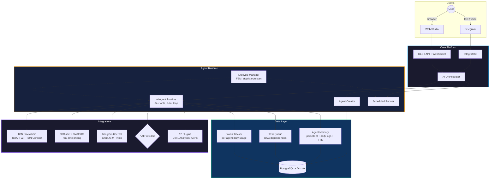

<div align="center">


<br><br>

# TON Agent Platform

### Autonomous AI Agents for the TON Blockchain

*Describe what you want in plain text or voice — get a 24/7 autonomous agent in seconds. No code. No servers.*

<br>

[](https://identityhub.app/contests/ai-hackathon?submission=cmmnwv6sg001b01oboxo8f57r)
[](https://identityhub.app/contests/agent-tooling-fast-grants?submission=cmlz5smqj000101p7wao32nfd)

<br>

[](https://www.typescriptlang.org)
[](https://nodejs.org)
[](https://www.postgresql.org)
[](LICENSE)
[](https://t.me/TonAgentPlatformBot)
[](https://tonagentplatform.com)

<br>

[**Launch Bot**](https://t.me/TonAgentPlatformBot) &nbsp;&bull;&nbsp; [**Open Studio**](https://tonagentplatform.com/studio.html) &nbsp;&bull;&nbsp; [**Website**](https://tonagentplatform.com) &nbsp;&bull;&nbsp; [**Channel**](https://t.me/TONAgentPlatform)

</div>

---

## Overview

TON Agent Platform enables anyone to create **autonomous AI agents** that operate on the TON blockchain through Telegram &mdash; without writing a single line of code.

Describe your task in text or voice. The AI generates a system prompt, selects from 84+ tools, and deploys the agent in seconds. Each agent gets its own TON wallet and can operate as a real Telegram user via MTProto.

> **Built by two young developers. Previous TON grant winner.**

---

## Key Features

<table>
<tr><td width="50%" valign="top">

**AI-First Creation**
Describe a task in text or voice &rarr; AI generates prompt + picks tools &rarr; agent runs autonomously

**7 AI Providers**
Gemini, GPT-4o, Claude, Groq, DeepSeek, OpenRouter, Together &mdash; switch per agent or use platform fallback

**Voice Commands**
Send a voice message &rarr; transcription &rarr; agent created or command executed

**84+ Agent Tools**
TON, gifts, NFTs, DeFi, web search, Telegram userbot, state management, notifications, scheduling

**Studio Dashboard**
Full web interface: agent settings, memory editor, task manager, token usage analytics, lifecycle control

</td><td width="50%" valign="top">

**Gift Marketplace Integration**
Real-time pricing via GiftAsset + SwiftGifts, arbitrage scanning, portfolio tracking, automated buy/sell

**Telegram Userbot (MTProto)**
Agents operate as real Telegram users &mdash; read chats, send messages, react, join channels, search, forward

**Per-Agent Memory & Tasks**
Persistent memory with FTS search, daily logs, task queue with DAG dependencies, token usage tracking

**Security-First Architecture**
Sandboxed execution, SSRF protection, IDOR checks, prompt injection defense, memory poisoning prevention

**12 Plugins + 22 Templates**
DeDust, STON.fi, EVAA, CoinGecko, Whale Tracker, Discord, Email, Slack &mdash; install with one click

</td></tr>
</table>

---

## Architecture



---

## Agent Tools (84+)

| Category | Examples | Count |
|:---------|:---------|:-----:|
| **TON Blockchain** | `get_ton_balance` `send_ton` `get_agent_wallet` `get_nft_floor` | 4 |
| **Gift Marketplace** | `get_gift_floor_real` `scan_real_arbitrage` `buy_catalog_gift` `buy_resale_gift` `list_gift_for_sale` `get_price_list` `get_market_overview` `get_user_portfolio` | 15 |
| **DeFi** | `dex_get_prices` `dex_swap_simulate` `dex_get_pool_info` `dex_get_routes` | 4 |
| **Telegram Userbot** | `tg_send_message` `tg_get_messages` `tg_join_channel` `tg_search_messages` `tg_forward` `tg_react` `tg_set_avatar` `tg_create_poll` | 20 |
| **Web & Search** | `web_search` `fetch_url` `http_fetch` | 3 |
| **State & Notifications** | `get_state` `set_state` `notify` `notify_rich` | 4 |
| **Agent Coordination** | `list_my_agents` `ask_agent` `list_plugins` `run_plugin` | 4 |
| **NFT Analytics** | `get_nft_collection` `get_nft_items` `get_nft_history` | 3 |
| **Scheduling** | `set_timer` `cancel_timer` `get_time` `sleep` | 4 |
| **Plugins** | 12 plugins with their own tool sets | ~23 |

---

## Plugin Library

| Plugin | Category | Description |
|:-------|:---------|:------------|
| DeDust DEX | DeFi | Swaps, liquidity pools, price feeds |
| STON.fi DEX | DeFi | AMM swaps, pool analytics |
| EVAA Lending | DeFi | Lending/borrowing on EVAA Protocol |
| TonAPI Pro | Data | Wallet data, NFTs, transactions |
| CoinGecko | Data | Real-time & historical crypto prices |
| Whale Tracker | Analytics | Large wallet movement monitoring |
| TON Stat | Analytics | Network stats, DEX volume, chain metrics |
| Discord | Alerts | Discord channel notifications |
| Email | Alerts | SMTP email alerts |
| Slack | Alerts | Slack workspace notifications |
| Drain Detector | Security | AI-powered wallet drain detection |
| Contract Auditor | Security | Smart contract risk analysis |

---

## Studio Dashboard

The web-based Studio provides full control over every agent:

| Tab | Description |
|:----|:------------|
| **Soul** | Agent personality and system prompt editor |
| **Security** | Immutable safety rules (read-only) |
| **Strategy** | Business strategy and goals |
| **Heartbeat** | Proactive tasks when agent is idle |
| **AI Settings** | Provider, model, API key per agent |
| **Capabilities** | Toggle 20 capability categories |
| **Lifecycle** | Real-time status, uptime, start/stop/restart |
| **Token Usage** | Daily consumption chart, cost estimation, budget limits |
| **Memory** | Persistent memory editor, FTS search, daily log viewer |
| **Tasks** | Task queue with priorities, dependencies, scheduling |
| **Contacts** | Users the agent interacted with, allowed/admin toggles |
| **Blocklist** | Keyword filtering with word-boundary matching |
| **Triggers** | Context injection rules on keyword match |
| **Telegram** | Userbot auth (QR login / phone+OTP) |
| **Wallet** | TON wallet address, mnemonic, balance |
| **Chat** | Conversation history with the agent |
| **Audit** | Execution logs and error tracking |

---

## Quick Start

```bash
# Clone and install
git clone https://github.com/spendollars/TonAgentPlatform
cd TonAgentPlatform && pnpm install

# Configure
cp apps/builder-bot/.env.example apps/builder-bot/.env
# Edit .env: add BOT_TOKEN, DB credentials, AI API keys (optional)

# Launch
docker compose -f infrastructure/docker-compose.prod.yml up -d   # PostgreSQL
pnpm --filter builder-bot dev                                     # Bot + API
```

Open Telegram &rarr; [@TonAgentPlatformBot](https://t.me/TonAgentPlatformBot) &rarr; `/start`

---

## Tech Stack

| Layer | Technology |
|:------|:-----------|
| **Bot Framework** | Telegraf v4 |
| **Language** | TypeScript 5.x, strict mode |
| **AI Providers** | Gemini 2.5, Claude, GPT-4o, Groq, DeepSeek, OpenRouter, Together |
| **Database** | PostgreSQL 15 + Drizzle ORM |
| **Agent Sandbox** | Node.js VM (isolated, SSRF-protected) |
| **Agent Runtime** | Autonomous agentic loop (function calling, 5 iterations, compaction) |
| **TON** | @ton/core, @ton/ton, @ton/crypto, @tonconnect/sdk, TonAPI v2 |
| **Telegram** | GramJS MTProto (userbot) + Telegraf (bot) |
| **Gift APIs** | GiftAsset + SwiftGifts (rate-limited, cached, 7 tools) |
| **Infra** | Docker Compose + nginx + PM2 + Let's Encrypt |
| **Monitoring** | Per-agent token tracking, lifecycle FSM, audit trail |

---

## Security

| Layer | Protection |
|:------|:-----------|
| **Execution** | Sandboxed VM with restricted globals; no `fs`, `child_process`, `net` |
| **Network** | SSRF protection: blocks localhost, private IPs, metadata endpoints |
| **Resources** | 30s max execution, memory cap per agent, daily token budgets |
| **Code** | AI security scanner before deployment |
| **API** | IDOR ownership verification on every endpoint, CORS allowlist |
| **Auth** | Telegram OAuth + deeplink + QR login; no passwords stored |
| **Anti-Loop** | A-B-A-B pattern detection, result-aware stall detection, loop guard |
| **Flood** | Adaptive flood gate with jittered decay, per-chat serial queue |
| **Financial** | Atomic operation lock with generation counter (prevents double-spend) |
| **Memory** | Group chat poisoning prevention (only owner can write agent memory) |
| **Input** | Prompt injection defense: user input sanitization, XML tag stripping |

---

## Roadmap

- [x] AI-first agent creation (text + voice)
- [x] 7 AI providers with fallback chain + per-agent switching
- [x] 84+ agent tools (TON, gifts, NFT, DeFi, web, Telegram, Discord, X)
- [x] Multi-platform: Telegram, Discord, X/Twitter
- [x] GiftAsset + SwiftGifts real-time pricing
- [x] Telegram userbot (MTProto) &mdash; agents as real users
- [x] Shared Session Router &mdash; multi-agent on one TG account
- [x] Studio Dashboard with 17 settings tabs
- [x] Per-agent memory, tasks, token tracking
- [x] Security audit: IDOR, XSS, data loss, infinite loop protection
- [x] TON Connect v2 wallet integration
- [x] 12 plugins + 22 templates + marketplace
- [x] Voice commands + speech recognition
- [x] Visual workflow constructor
- [ ] Telegram Mini App
- [ ] On-chain agent registry (TON smart contract)
- [ ] DAO governance + platform token

---

## Project Structure

```
ton-agent-platform/
├── apps/
│   ├── builder-bot/          # Main application
│   │   ├── src/
│   │   │   ├── agents/       # AI runtime, orchestrator, runner, tools
│   │   │   ├── services/     # Lifecycle, memory, tasks, tokens, hooks, flow control
│   │   │   ├── api-server.ts # REST API (80+ endpoints)
│   │   │   ├── bot.ts        # Telegram bot handlers
│   │   │   └── db/           # PostgreSQL schema + Drizzle ORM
│   │   └── plugins/          # 12 installable plugins
│   └── landing/              # Web Studio (HTML/CSS/JS)
│       ├── studio.html       # Studio UI
│       ├── studio.js         # 11K+ lines of Studio logic
│       └── studio.css        # Studio styles
├── infrastructure/           # Docker Compose, nginx configs
├── packages/                 # Shared packages
└── scripts/                  # Utility scripts
```

---

## Contributing

We welcome contributions! Please see [CONTRIBUTING.md](CONTRIBUTING.md) for guidelines.

## License

MIT &copy; 2026 TON Agent Platform. See [LICENSE](LICENSE) for details.

---

<div align="center">

**Built for the TON ecosystem**

[tonagentplatform.com](https://tonagentplatform.com) &nbsp;&bull;&nbsp; [@TonAgentPlatformBot](https://t.me/TonAgentPlatformBot) &nbsp;&bull;&nbsp; [Telegram Channel](https://t.me/TONAgentPlatform)

<br>

<sub>Made with determination by two young developers from Russia</sub>

</div>
